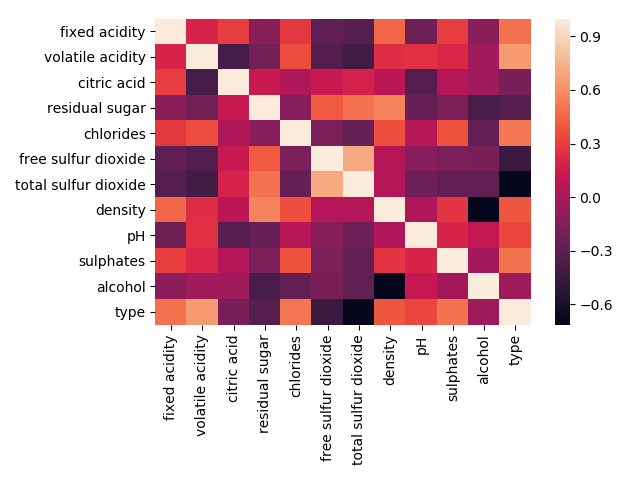

# Machine Learning 2018Autumn 
## 个人作业 葡萄酒分类
### 16231246 秦子柠


## Overview
> * 使用xgboost(eXtreme Gradient Boosting)作为框架
> * 决策树升级版
> * 对数据预处理依赖性较小：自动根据添加子树后模型精度的提升情况判断在此节点是否应该分裂
> * 与神经网络相比，训练速度极快，对调参技巧的要求较为普通。


## 1. 数据预处理

* 相关性检测
> 使用pandas库读取训练数据csv文件后，首先先看看各项feature与label的相关性
> 
>
> 从中我们可以看出，二氧化硫的含量与酒的种类的负相关性较高，而挥发性酸则是正相关性较高。


* 人工构造新特征
> 首先观察数据各项，发现二氧化硫的含量被分成了游离部分和总量。由常识可知总量肯定超过其中游离的含量，因此通过总量减去游离部分，得到非游离部分，以此代替原来的总二氧化硫含量作为特征。
>
> 得到新的相关性矩阵如下
>
> 
>
> 
>
> 


X|1 | 2 | 3 | 4 | 5 | 6 | 7 | 8 | 9 | 10 | 11 | type
 :----------- | :----------- | :----------- | :----------- | :----------- | :----------- | :----------- | :----------- | :----------- | :----------- | :----------- | :----------- | :----------- | 
fixed acidity | 1 | 0.2 | 0.31 | -0.12 | 0.29 | -0.29 | -0.3 | 0.46 | -0.23 | 0.31 | -0.11 | 0.49
volatile acidity | 0.2 | 1 | -0.39 | -0.2 | 0.36 | -0.34 | -0.37 | 0.25 | 0.26 | 0.22 | -0.03 | 0.64
citric acid | 0.31 | -0.39 | 1 | 0.14 | 0.03 | 0.13 | 0.19 | 0.09 | -0.33 | 0.05 | -0.03 | -0.19
residual sugar | -0.12 | -0.2 | 0.14 | 1 | -0.13 | 0.41 | 0.46 | 0.56 | -0.26 | -0.17 | -0.38 | -0.34
chlorides | 0.29 | 0.36 | 0.03 | -0.13 | 1 | -0.18 | -0.26 | 0.37 | 0.06 | 0.38 | -0.27 | 0.51
free sulfur dioxide | -0.29 | -0.34 | 0.13 | 0.41 | -0.18 | 1 | 0.49 | 0.05 | -0.13 | -0.17 | -0.19 | -0.45
non-free sulfur dioxide | -0.3 | -0.37 | 0.19 | 0.46 | -0.26 | 0.49 | 1 | 0.05 | -0.23 | -0.27 | -0.28 | -0.68
density | 0.46 | 0.25 | 0.09 | 0.56 | 0.37 | 0.05 | 0.05 | 1 | 0.02 | 0.27 | -0.71 | 0.4
pH | -0.23 | 0.26 | -0.33 | -0.26 | 0.06 | -0.13 | -0.23 | 0.02 | 1 | 0.21 | 0.12 | 0.34
sulphates | 0.31 | 0.22 | 0.05 | -0.17 | 0.38 | -0.17 | -0.27 | 0.27 | 0.21 | 1 | -0.01 | 0.5
alcohol | -0.11 | -0.03 | -0.03 | -0.38 | -0.27 | -0.19 | -0.28 | -0.71 | 0.12 | -0.01 | 1 | -0.03
type | 0.49 | 0.64 | -0.19 | -0.34 | 0.51 | -0.45 | -0.68 | 0.4 | 0.34 | 0.5 | -0.03 | 1


* 无量纲化与维度选择
> * 数据的大小范围不一致。
> * 通过pandas库绘制数据的直方图，发现分布不一致。（图片较多在此不一一列出）
> * 可以选择通过归一化(Rescaling)/标准化(Standardization)放缩到同一区间或是转为标准正态分布。
> * 还可以考虑使用数据变换等方法构造新特征，再用PCA等方法对数据进行降维。
> * 最终实际操作中发现只使用Rescaling的效果是最好的。原因推测是XGBoost在训练中已经使用了树的模型对特征进行了选择，因此再通过其他预处理方式增加处理的复杂度的收益未必很好。

## 2. XGBoost 原理简介
> XGBoost主要利用了集成学习的有关原理，通过在训练中加入多个弱分类器，将其进行组合成一个强分类器。
> 
> 主要流程：
> 1. 按照参数设定初始化一颗决策树，开始进行分类。
> 2. 对损失函数进行泰勒展开（到二阶项），计算损失。
> 3. 逐个试验按照哪个特征添加子决策树能使得损失在当前模型下能有最大的模型收益提升（收益的衡量综合考量了左右子树的收益以及加新树前的收益）
> 4. 将满足上一条条件的子决策树加到模型中，通过正则项的作用，规避过拟合的风险。
> 5. 重复2-4，直到模型的泛化能力达到一定水平。（本题中的设定是在验证集上的表现达到一定标准）

## 3. 模型训练与参数调整

设定影响较大的主要参数（学习率、树的最大深度、叶子节点权重和）的调整范围：
```
learning_rate = [0.1 + 0.01 * k for k in range(100)] + [0.01, 0.05, 0.001, 0.005, 0.0005]
max_dpt = [2, 3, 4]
mw = [1, 2, 3]
```
k-fold 交叉验证：
```python
kfold = sklearn.model_selection.StratifiedKFold(n_splits=10, shuffle=True, random_state=6)
```
模型训练与筛选（实际使用时，由于每一组参数的分类accuracy总能在0.98以上，故筛选合适的参数时设置了较为严格的下限）
```python
for train_index, valid_index in kfold.split(X=feature, y=label):
    model = xgb.XGBClassifier(
        silent=True,
        learning_rate=lr,
        max_depth=mx_d,
        n_jobs=6,       # 并发进程数
        gamma=0,        # 叶子节点分裂成子树需要满足的最小梯度下降值
        min_child_weight=min_w,
        max_delta_step=0,   # 限制子树权重改变的最大步长，经试验该参数为0较合适
        subsample=1,    # 训练样本取总样本的比例
        reg_alpha=1e-5, # L1-正则
        reg_lambda=1)   # L2-正则
    model.fit(feature[train_index], label[train_index],
              verbose=False,
              eval_set=[(feature[valid_index], label[valid_index])],
              early_stopping_rounds=70)     # 连续70epoches在验证集上的accuracy没有增加的话，返回accuracy转折点处的模型
    acc_list.append(skl.metrics.accuracy_score(label[valid_index], model.predict(feature[valid_index])))
if np.mean(acc_list)>0.9968:
    print(np.mean(acc_list), 'lr=', lr, 'max_depth=', mx_d, 'min_weight=', min_w)
# 综合10折交叉验证的考量选择较好的参数组合
```

优秀参数候选：
```python
# lr,max_depth,min_weight= 0.35, 2, 2
# lr= 0.52,max_depth= 2,min_weight= 1
# lr= 0.57,max_depth= 2,min_weight= 2
# lr= 0.62,max_depth= 2,min_weight= 1
# lr= 0.64,max_depth= 2,min_weight= 1
# lr= 0.75,max_depth= 2,min_weight= 1
# lr= 0.75,max_depth= 2,min_weight= 2
# lr= 1.09,max_depth= 2,min_weight= 2
```
使用这些参数组合，搭配上交叉验证进行训练。

当lr=0.64, max_depth=2, min_weight=1时，经输出分类结果并提交发现，这组参数在测试集上的表现最好。

保存此时的模型（使用pickle.dump）。